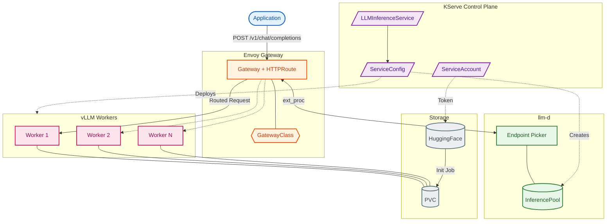
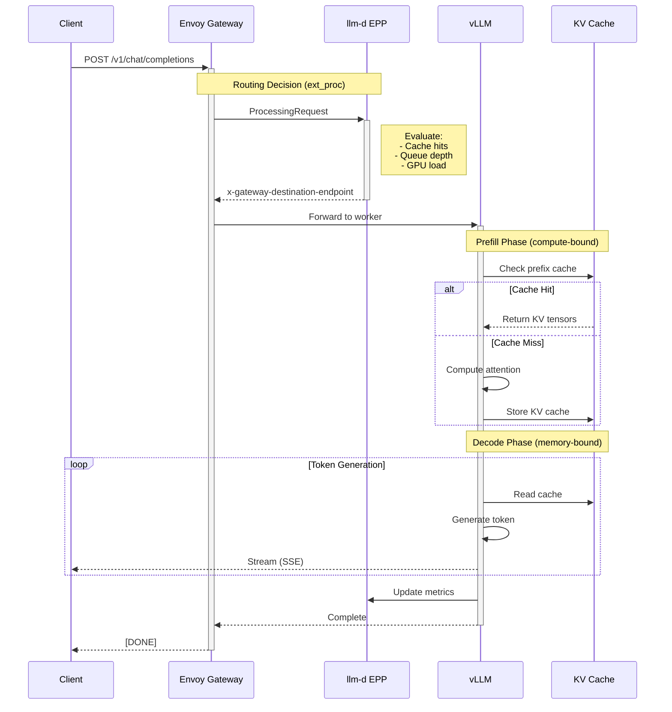

# KServe Demo with vLLM and llm-d

This repository provides reusable Kustomize manifests for deploying LLM inference services using [KServe](https://kserve.github.io/), [vLLM](https://docs.vllm.ai/), and [llm-d](https://llm-d.ai/).

## Architecture Overview

The stack combines four key components to provide cloud-native LLM inference:



### Component Responsibilities

| Layer | Component | Role |
|-------|-----------|------|
| **Gateway** | Envoy Gateway | Ingress, routing, rate limiting, authentication |
| **Control Plane** | KServe | Model lifecycle, scaling, Kubernetes-native CRDs |
| **Scheduling** | llm-d EPP | Cache-aware routing, load balancing, request scheduling |
| **Execution** | vLLM | High-performance inference with PagedAttention |
| **Storage** | PVC + HuggingFace | Model weight storage and distribution |

### Request Flow



## Prerequisites

- Kubernetes cluster with GPU support
- [KServe](https://kserve.github.io/kserve/master/get_started/) installed
- [Envoy Gateway](https://gateway.envoyproxy.io/) installed
- Storage provisioner (default uses `local-path`)
- [kubectl](https://kubernetes.io/docs/tasks/tools/) and [kustomize](https://kustomize.io/) installed

## Directory Structure

```
.
├── kustomization.yaml          # Main kustomization with namespace and patches
├── gateway/                    # Gateway API resources
│   ├── gateway-class.yaml      # Envoy GatewayClass
│   ├── gateway.yaml            # KServe ingress gateway
│   └── kustomization.yaml
├── llm-config/                 # LLM serving configuration
│   ├── endpoint-picker-config.yaml  # EPP scheduling config
│   ├── llmisvc-config.yaml     # LLMInferenceServiceConfig template
│   ├── service-account.yaml    # ServiceAccount for HF access
│   ├── hf-secret.yaml          # HuggingFace token (placeholder)
│   └── kustomization.yaml
└── models/
    └── example-model/          # Example model deployment
        ├── pvc.yaml            # Storage for model weights
        ├── model-download-job.yaml  # Job to download model
        ├── inference-service.yaml   # LLMInferenceService
        └── kustomization.yaml
```

## Quick Start

### 1. Configure HuggingFace Token

Create a base64-encoded token:

```bash
echo -n "hf_your_token_here" | base64
```

Update the token in `kustomization.yaml` under the patches section:

```yaml
patches:
  - target:
      kind: Secret
      name: hf-token
    patch: |-
      - op: replace
        path: /data/HF_TOKEN
        value: YOUR_BASE64_ENCODED_TOKEN
```

### 2. Configure Namespace

Update the namespace in `kustomization.yaml`:

```yaml
namespace: your-namespace
```

### 3. Deploy

```bash
# Preview the manifests
kubectl kustomize .

# Apply to cluster
kubectl apply -k .
```

### 4. Monitor Model Download

```bash
kubectl get jobs -n your-namespace
kubectl logs -f job/example-model-init-job -n your-namespace
```

### 5. Check Inference Service

```bash
kubectl get llminferenceservice -n your-namespace
kubectl get pods -n your-namespace
```

## Customization

### Deploying a Different Model

1. Copy the `models/example-model` directory:

```bash
cp -r models/example-model models/my-model
```

2. Update the model configuration in the new directory:

- `pvc.yaml`: Adjust storage size for your model
- `model-download-job.yaml`: Update the HuggingFace model path
- `inference-service.yaml`: Configure resources and vLLM arguments

3. Update `kustomization.yaml` to include your model:

```yaml
resources:
  - gateway/
  - llm-config/
  - models/my-model/
```

### Resource Configuration Guide

| Model Size | GPUs | Memory | Example Models |
|------------|------|--------|----------------|
| 0.5B-7B    | 1    | 16-32Gi | Qwen2.5-0.5B, Llama-2-7B |
| 13B-34B    | 2    | 64Gi   | Llama-2-13B, CodeLlama-34B |
| 70B+       | 4+   | 128Gi+ | Llama-2-70B, Mixtral-8x7B |

### Common vLLM Arguments

Configure in `inference-service.yaml` under `VLLM_ADDITIONAL_ARGS`:

```yaml
env:
  - name: VLLM_ADDITIONAL_ARGS
    value: >
      --gpu-memory-utilization 0.95
      --max-model-len 4096
      --tensor-parallel-size 2
      --enforce-eager
      --enable-auto-tool-choice
      --tool-call-parser llama3_json
```

### Storage Class

Update storage class for your cluster:

```yaml
# In kustomization.yaml
patches:
  - target:
      kind: PersistentVolumeClaim
      name: example-model-pvc
    patch: |-
      - op: replace
        path: /spec/storageClassName
        value: your-storage-class
```

## Components

### Gateway

Configures Envoy Gateway for routing traffic to inference services.

### LLM Config

- **llmisvc-config.yaml**: Template for LLM inference services using llm-d
- **endpoint-picker-config.yaml**: Scheduling configuration for request routing
- **hf-secret.yaml**: HuggingFace authentication token

### Models

Each model deployment includes:
- PVC for storing model weights
- Job to download model from HuggingFace
- LLMInferenceService for serving

## Testing the Deployment

Once deployed, test your model:

```bash
# Get the service URL from the LLMInferenceService
kubectl get llminferenceservice -n your-namespace

# Test with curl using the URL from above
curl -X POST http://<url-from-above>/v1/chat/completions \
  -H "Content-Type: application/json" \
  -d '{
    "model": "Qwen/Qwen2.5-0.5B-Instruct",
    "messages": [{"role": "user", "content": "Hello!"}]
  }'
```

## References

- [KServe Documentation](https://kserve.github.io/kserve/)
- [vLLM Documentation](https://docs.vllm.ai/en/latest/)
- [llm-d Documentation](https://llm-d.ai/docs/guide)
- [Envoy Gateway](https://gateway.envoyproxy.io/)

## License

MIT License - see [LICENSE](LICENSE) for details.
